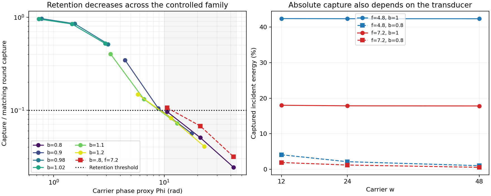

# Controlled aperture phase family: measured result

The 57 trajectories were run once after publication of freeze
`70736ccaa7fb3693bbabb404ba87af09a5d5b3be` in [PR #324](https://github.com/davidmdrpi/geometrodynamics/pull/324).
The [preregistered](aperture_phase_prereg.md) numerical and phase-coverage gates
are **True** and **True**, respectively.

| Registered claim | Frozen result |
|---|---|
| Every designated high-phase case retains >=10% of round capture | **FAILED_IN_DECLARED_FAMILY** |
| Both specified fits obey the approximate inverse-phase law | **SUPPORTED_IN_DECLARED_FAMILY** |

9 of 10 designated high-phase cases fall below 10% retention.
The smallest is 0.02426. This rejects uniform 10%
retention in the declared family. It does not show zero transport, nor does it
exclude other port models or geometries. The inverse-phase result is a
three-carrier, finite-range test at b=.8, not an asymptotic scaling theorem.
Neither result establishes quantum mechanics or self-consistent feedback.
The post-hoc review comparison below shows that this inverse-phase trend
largely tracks free-field spectral dephasing already encoded in the frozen
phase diagnostic. The additional empirical result is how closely integrated
lead capture follows that free coherence under the specified port dynamics.



## What was controlled

Primary a*w=4.8; the second coherent-port family has a*w=7.2. The carrier
values are 12, 24 and 48; gamma/w=2/3 and the compact source contains three
cycles at each carrier. This fixes coordinate aperture/wavelength, relative
pulse bandwidth and dimensionless damping strength. All captures use the
complete incident energy and the same stop time 1.75 in round-transit units.
The horizon is not enlarged after observing a poor capture. Changes in bulk
spectral density and the geometry remain part of the question, rather than
being normalized away. The numerical implementation removes only exact dark
and +/-m degeneracies of the #323 port representation.

These distributed L2-normalized coherent transducers remain assumptions.
They are not physical holes with a derived boundary-matching law. Gamma is
scaled as a controlled parameter, not determined by GR. The corrective-kick
budget is zero. Static field-plus-lead energy is accounted for throughout.
There is no metric pump, dynamical R3 background, moving mouth or reinjection.

## Primary family, a*w=4.8

Capture and remaining energy are percentages of complete incident energy.
Retention is relative to the matching round case. Exact phase spread uses the
registered round free-source modal weights, not measured receiver amplitudes.

| b | w | Proxy Phi | Exact weighted phase std | Capture (%) | Retention | Remaining bulk (%) |
|---:|---:|---:|---:|---:|---:|---:|
| 0.8 | 12 | 10.603 | 2.700 | 4.0845 | 0.0964 | 59.967 |
| 0.8 | 24 | 21.206 | 5.464 | 2.1398 | 0.0506 | 62.409 |
| 0.8 | 48 | 42.412 | 10.961 | 1.0266 | 0.0243 | 63.681 |
| 0.9 | 12 | 4.422 | 1.189 | 14.6524 | 0.3459 | 48.514 |
| 0.9 | 24 | 8.843 | 2.408 | 4.4245 | 0.1045 | 59.135 |
| 0.9 | 48 | 17.686 | 4.832 | 2.3762 | 0.0562 | 61.187 |
| 0.98 | 12 | 0.777 | 0.217 | 40.9074 | 0.9657 | 21.466 |
| 0.98 | 24 | 1.554 | 0.439 | 35.9546 | 0.8495 | 26.394 |
| 0.98 | 48 | 3.109 | 0.882 | 21.6863 | 0.5125 | 40.650 |
| 1 | 12 | 0.000 | 0.000 | 42.3607 | 1.0000 | 19.695 |
| 1 | 24 | 0.000 | 0.000 | 42.3241 | 1.0000 | 19.700 |
| 1 | 48 | 0.000 | 0.000 | 42.3149 | 1.0000 | 19.697 |
| 1.02 | 12 | 0.732 | 0.207 | 40.4585 | 0.9551 | 21.276 |
| 1.02 | 24 | 1.464 | 0.421 | 35.7335 | 0.8443 | 25.962 |
| 1.02 | 48 | 2.928 | 0.844 | 22.0190 | 0.5204 | 39.664 |
| 1.1 | 12 | 3.271 | 0.955 | 17.0178 | 0.4017 | 43.408 |
| 1.1 | 24 | 6.543 | 1.938 | 5.5647 | 0.1315 | 54.808 |
| 1.1 | 48 | 13.086 | 3.891 | 3.0513 | 0.0721 | 57.307 |
| 1.2 | 12 | 5.760 | 1.736 | 6.2604 | 0.1478 | 52.571 |
| 1.2 | 24 | 11.519 | 3.526 | 3.4774 | 0.0822 | 55.300 |
| 1.2 | 48 | 23.038 | 7.079 | 1.7206 | 0.0407 | 57.043 |

## Second aperture family, a*w=7.2

| b | w | Proxy Phi | Exact weighted phase std | Capture (%) | Retention | Remaining bulk (%) |
|---:|---:|---:|---:|---:|---:|---:|
| 0.8 | 12 | 10.603 | 2.128 | 1.9118 | 0.1062 | 34.264 |
| 0.8 | 24 | 21.206 | 4.330 | 1.2034 | 0.0674 | 35.696 |
| 0.8 | 48 | 42.412 | 8.697 | 0.5605 | 0.0315 | 36.477 |
| 1 | 12 | 0.000 | 0.000 | 18.0078 | 1.0000 | 11.552 |
| 1 | 24 | 0.000 | 0.000 | 17.8441 | 1.0000 | 11.594 |
| 1 | 48 | 0.000 | 0.000 | 17.8034 | 1.0000 | 11.570 |

## Preregistered inverse-phase fits

Fit log(retention)=intercept-beta*log(Phi), only b=.8, at both footprints.
The proxy spans 10.60–42.41 rad. The registered acceptance region is
beta in [.5,1.5] and maximum absolute log residual <=.25 for **both** fits.
No alternative b slice, peak-flux exponent or time window replaces this test.

| a*w | Fine beta | Coarse beta | Fine max log residual | Within declared law bounds |
|---:|---:|---:|---:|---|
| 4.8 | 0.995334 | 0.995412 | 0.029531 | True |
| 7.2 | 0.876802 | 0.876967 | 0.102671 | True |

These deterministic fits have only three points each. A passing law is only
supported in this finite interval. The exact source-weighted phase standard
deviation passes the separately stated coverage gate, but a broad asymptotic
regime and extrapolation to throat-scale resolution remain unestablished.
The near-round deformation cases report behavior outside the fit range;
they are not added as convenient points to improve the fitted law.

## Review follow-up: free coherence versus integrated capture

The [independent review](https://github.com/davidmdrpi/geometrodynamics/pull/324#issuecomment-6099053228)
correctly identifies the leading dephasing mechanism. This comparison is
**post-hoc interpretation** of quantities already archived by the frozen run,
not a newly registered test or a new simulation. Both original labels remain.
The [machine-readable comparison](aperture_phase_coherence.json) contains all
21 nonround fine cases and binds the original manifest.

Let C_free=|sum rho_lm exp(i delta_phi_lm)|^2, using the registered normalized
round free-source energy weights. This depends only on the spectrum and
source/aperture weights, without evolving the coupled ports. Let R denote
the measured nonround/round integrated lead capture. Across all 21 cases,
R/C_free lies in **[0.986770, 1.366579]**, with
median **1.065293**.

| a*w | b | w | Measured retention R | Free coherence C_free | R/C_free |
|---:|---:|---:|---:|---:|---:|
| 4.8 | 0.8 | 12 | 0.096422 | 0.090512 | 1.065293 |
| 4.8 | 0.8 | 24 | 0.050558 | 0.042512 | 1.189273 |
| 4.8 | 0.8 | 48 | 0.024262 | 0.021254 | 1.141530 |
| 4.8 | 0.9 | 12 | 0.345896 | 0.253111 | 1.366579 |
| 4.8 | 0.9 | 24 | 0.104537 | 0.102201 | 1.022863 |
| 4.8 | 0.9 | 48 | 0.056156 | 0.050971 | 1.101712 |
| 4.8 | 0.98 | 12 | 0.965693 | 0.954094 | 1.012157 |
| 4.8 | 0.98 | 24 | 0.849508 | 0.824465 | 1.030374 |
| 4.8 | 0.98 | 48 | 0.512499 | 0.464383 | 1.103611 |
| 4.8 | 1.02 | 12 | 0.955095 | 0.957854 | 0.997120 |
| 4.8 | 1.02 | 24 | 0.844283 | 0.837819 | 1.007715 |
| 4.8 | 1.02 | 48 | 0.520360 | 0.494704 | 1.051862 |
| 4.8 | 1.1 | 12 | 0.401734 | 0.407121 | 0.986770 |
| 4.8 | 1.1 | 24 | 0.131479 | 0.118437 | 1.110113 |
| 4.8 | 1.1 | 48 | 0.072109 | 0.068702 | 1.049595 |
| 4.8 | 1.2 | 12 | 0.147789 | 0.125958 | 1.173316 |
| 4.8 | 1.2 | 24 | 0.082162 | 0.078053 | 1.052648 |
| 4.8 | 1.2 | 48 | 0.040662 | 0.039123 | 1.039327 |
| 7.2 | 0.8 | 12 | 0.106163 | 0.094409 | 1.124506 |
| 7.2 | 0.8 | 24 | 0.067440 | 0.053568 | 1.258949 |
| 7.2 | 0.8 | 48 | 0.031484 | 0.026800 | 1.174773 |

On the same preselected b=.8 slices, the free-coherence fits already closely
predict the integrated-capture exponents:

| a*w | Registered capture beta | Post-hoc free-coherence beta |
|---:|---:|---:|
| 4.8 | 0.995334 | 1.045194 |
| 7.2 | 0.876802 | 0.908347 |

All 10 designated high-phase cases have C_free<.1.
The one measured retention above .1 is b=.8,w=12,a*w=7.2: free coherence
about .0944 is multiplied by R/C_free about 1.125, lifting retention to .1062.
Thus the free diagnostic predicted suppression before port evolution in
principle. It was not used as a prospective capture predictor or ratio gate
in this protocol. The principal additional information from the trajectories
is the measured port/propagation correction R/C_free and its energy ledger,
not discovery of an otherwise unknown inverse-phase mechanism.

### What the Fresnel asymptotic does and does not establish

For a single high-l block, uniform m weights and the quadratic phase
approximation give the continuum factor

    A(Phi) = integral_0^1 exp(i Phi x^2) dx
           = Phi^(-1/2) integral_0^sqrt(Phi) exp(i u^2) du,
    |A(Phi)|^2 ~ pi/(4 Phi) as Phi -> infinity.

The sign-reversed phase has the same squared magnitude. The standard Fresnel
limits and asymptotic expansions are given in
[DLMF 7.5](https://dlmf.nist.gov/7.5) and
[DLMF 7.12(ii)](https://dlmf.nist.gov/7.12#ii).
There is therefore an analytic inverse-phase asymptotic for this idealized
free factor. The earlier caution about no established asymptotic exponent
applies to **integrated capture in this full packet/port family**, not to
the Fresnel integral itself.

The archived C_free uses the exact square-root frequencies and a weighted
sum over l as well as discrete m; Phi uses the carrier alone. Consequently
pi/(4 Phi) is not its exact finite-range normalization. At b=.8 the ratios
C_free/[pi/(4 Phi)] are 1.222, 1.148, 1.148 for a*w=4.8 and
1.275, 1.446, 1.447 for a*w=7.2 as w increases. In particular the reported
band on R/C_free cannot be copied unchanged onto R/[pi/(4 Phi)].
The latter reaches about 1.82 in the b=.8,w=24,a*w=7.2 case.

Whether R/C_free stays bounded above and away from zero at much larger phase
is not settled by these samples. A subsequent protocol could put a prospective
band on that ratio, explicitly excluding or handling near-zero C_free, and
check the packet-weighted analytic approximation separately. The current
observed [0.987,1.367] band is not retroactively made a success criterion.

### Portable re-scoring test

The review also found that the evidence test required exact dictionary
equality after recomputing np.polyfit. Least-squares/LAPACK roundoff made
Python 3.10 CI fail although its fit values differed only in the last digits;
the Python 3.12 job passed. The revised test admits absolute 1e-12, with zero
relative tolerance, **only for beta and maximum log residual**. Fit decisions,
all labels and other re-scored fields remain exact, as do file/source hashes.
Regression tests accept last-bit fit changes but reject material fit changes,
changed labels, changed fit decisions and changes to other recorded values.
This edits the post-freeze evidence test, not the frozen scorer, protocol,
sources, thresholds or simulation data. CPU-dispatch testing alone does not
cover differences across NumPy/LAPACK versions.

Local validation uses Python 3.12.14 with NumPy 2.5.3 and separately 2.2.6.
The latter reproduces failure of the former exact-equality assertion, with
maximum fit drift 2.67e-15; all 64 focused tests pass with the revised test
in both environments. The Python 3.10 CI job remains a separate check.

## Verification and energy accounting

| Diagnostic | Largest observed | Frozen limit |
|---|---:|---:|
| energy_error | 4.56498e-13 | 1e-09 |
| final_energy_error | 0 | 1e-09 |
| port_error | 4.85723e-15 | 1e-08 |
| reconstructed_energy_error | 3.45121e-15 | 1e-08 |
| state_error | 3.7115e-15 | 1e-08 |
| early_flux | 4.5192e-19 | 1e-05 |
| cap_tail | 3.79184e-06 | 0.0001 |

Largest paired/refinement comparison is 0.00786581
in source-normalized two-port output L2, against .03. Separate time, mode and
extension comparisons are 7.29039e-05,
1.59296e-09 and 0.
The extension adds 4.20197e-11 of incident energy to B capture after 1.75 in
the one designated case. Its later flux is reported, not folded into the
primary measurement or either verdict. Reflected A energy plus captured B
energy plus remaining bulk energy closes the ledger in every trajectory.

Independent reconstruction uses archived forces incoming-outgoing, rebuilding
all field states and energies without re-solving the coupled port evolution.
Source formulas allow absolute roundoff <=1e-14 while grid, compact support
and inactive port remain exact. Stored incoming samples are used in physics
ledgers after validation. The frozen thresholds and source files are intact.

The original 58 focused tests passed before publication. A complete authenticated replay with AVX2, FMA3
and AVX512F NumPy features disabled reproduces both labels, both exponents
and every archived capture measurement. All 57 NPZ archives were inspected
with pickle disabled: 342 finite float64 arrays, with the declared configuration
metadata, and every manifest hash verified. CI runs the focused tests and full
archive reconstruction before the repository-wide suite.

## Evidence and chronology

- Run start: `2026-10-10T03:49:20.810600+00:00`.
- Run finish: `2026-10-10T03:50:44.676926+00:00`.
- Runtime: Python 3.12.14, NumPy 2.5.3, SciPy 1.18.1.
- [All 57 raw trajectories, result, manifest and timestamped provenance](../experiments/closure_ledger/runs/20261010_aperture_phase/).
- Manifest SHA-256: `02b8bd392282292cbf0f82a42dfdf17ba2263a84b709bebf38217fa394037a6d`.

Per-case start and finish UTC are recorded directly; no NPZ ZIP timestamp is
used as a run clock. The manifest authenticates the original arrays before
reconstruction. Replay checks all source hashes, measurements and both
verdicts. It never launches new production trajectories.

```sh
OPENBLAS_NUM_THREADS=1 python -m experiments.closure_ledger.aperture_phase_probe --manifest-sha 02b8bd392282292cbf0f82a42dfdf17ba2263a84b709bebf38217fa394037a6d
OPENBLAS_NUM_THREADS=1 python -m pytest -q tests/test_aperture_phase.py tests/test_aperture_transfer.py tests/test_mty_packet.py
python -m experiments.closure_ledger.aperture_phase_report
```

## Consequence for the next physical test

This family measures how much the static result depends on phase accumulation
under declared source and port scaling. It supplies no reason to extrapolate
static suppression unchanged to an evolving triaxial R3 geometry: anisotropy
can change during a transit, and mode coupling and metric work must then be
included. A future R3 study needs a new freeze, independently sampled geometry
phases, an explicit metric/port-work ledger and a pre-stated capture failure
criterion. The present study does not claim to have carried out that test.
