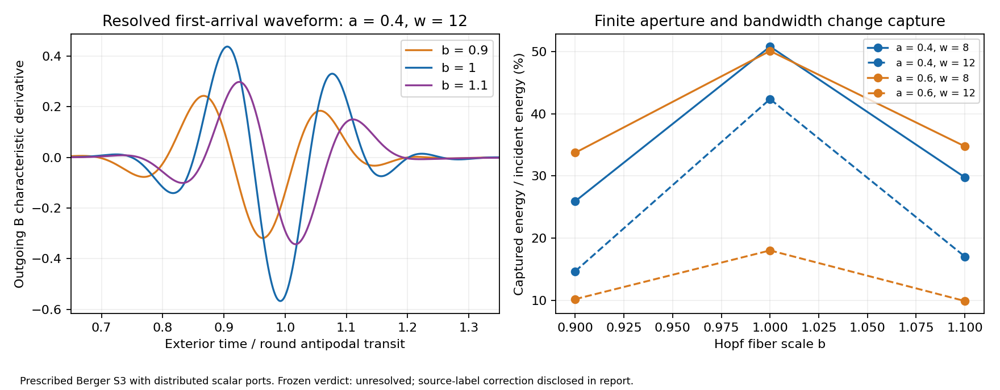

# Finite-aperture capture on a resolved compact geometry

The 35 archived cases show substantial first-arrival capture and a shifted
return in the declared Berger-S3 scalar model. Primary fine-grid capture is
**9.86%–50.81% of incident lead energy**. A +/-10% Hopf-fiber deformation
retains **34.59%–69.36%** of the matching round-sphere capture. Nonround
geometry substantially reduces capture; it does not eliminate it in this box.

There is an important diagnostic qualification. The **unaltered frozen
verdict is NUMERICALLY_UNRESOLVED**. One reverse-source diagnostic mistakenly
counted reflection at the driven B port as premature receiving-port arrival.
A separately labelled post-measurement correction checks arrival at A and
reconstructs the same archived dynamics. All numerical and mechanism gates
then pass, giving
**FINITE_APERTURE_TRANSFER_SUPPORTED_AFTER_DIAGNOSTIC_CORRECTION**.
This is not represented as an unqualified prospective pass.
The empirical conclusion is limited to capture retention in this finite
parameter box. The six mechanism gates do not supply six independent pieces
of evidence: two are structural controls and one is a derived timing-window
measurement. Large-phase robustness and propagation on the evolving R3
geometry remain untested.

## What is now resolved, and what is still assumed

PR #322 supplied a bulk edge with a prescribed travel time. This experiment
instead propagates a scalar field on an ultrastatic Berger S3, using its exact
Laplacian spectrum and spatially compact aperture profiles. The fine cutoff
retains 63,365 scalar harmonics (l<=56). Only their exactly equivalent
port-observable subspaces need evolution; unexcited dark modes are omitted.
No travel-time distribution is fitted to the answer.

This is the three-spatial-dimensional compact wave layer, not the earlier
S4 spatial bulk completion or an evolved GR solution. Berger deformation is
homogeneous anisotropy, not arbitrary inhomogeneous metric perturbation.
Apertures are distributed coherent transducers coupled to scalar leads, not
holes excised from the geometry. The port action is an additional physical
assumption. Captured flux means energy emitted down the receiving lead; it
is not all geometric-optics flux through a surface or a local energy snapshot.

Primary coupling is the conformal scalar xi=1/6, explicitly responsible for
exact round refocusing. Two minimal-scalar controls are also retained. Neither
coupling is derived from the BAM matter sector here. Aperture angles .4 and
.6 are round-coordinate footprints and are L2-normalized in the physical
Berger volume. They are not equal physical-radius mouths across the sweep.
The scalar lead strength gamma=8 and clock offset Delta=1.5 are fixed inputs.
There are no corrective kicks, timing fits or post-outcome parameter changes.

## Model and measured operator

The radius is 1/pi, so round antipodal geodesic transit is one. If b multiplies
Hopf fiber lengths, the squared wave frequencies are

\[
\omega_{lm}^2=\pi^2\left[l(l+2)+(b^{-2}-1)m^2+2\xi(4-b^2)\right],
\quad m=-l,-l+2,\ldots,l.
\]

The sphere scalar curvature is 2 pi^2(4-b^2). A compact radial aperture has
profile (1-(theta/a)^2)^4 for theta<a and vanishes outside. Character
quadrature supplies its harmonic coefficients without renormalizing the
truncated profile. Rotation matrix elements give displaced receiver profiles.

Variation of the scalar bulk action plus the two leads with endpoint
constraint psi_j(0)=sqrt(gamma)<w_j,phi> gives

\[
\ddot q+Kq+WW^T\dot q=2W a_{\rm in},\qquad
b_{\rm out}=W^T\dot q-a_{\rm in}.
\]

Consequently, with E=(|qdot|^2+q^T Kq)/2,

\[
E(t)-E(t_0)=\int_{t_0}^t
\left(|a_{\rm in}|^2-|b_{\rm out}|^2\right)ds.
\]

The source is cos(2 pi t)^4 cos(pi w t) on |t|<.25, zero otherwise.
All initial bulk coordinates and velocities are zero. The denominator for
capture is the complete incident lead energy, including any prompt reflection.
Remaining bulk energy is explicitly retained; it is not called a loss.

The code also computes the complete complex 2x2 frequency scattering matrix
at 18 preselected nonresonant frequencies per primary fine case. With
exp(-i omega t), the measured first-arrival B output is routed as

\[
t_{\rm return}=t_B+0.125-1.5,\qquad r(t_{\rm return})=-b_B(t_B).
\]

Every sample and its flux is retained exactly once. The handle changes phase
by -exp[i omega(0.125-Delta)]; a magnitude-only measurement cannot identify
Delta, and zero frequency carries no time-shift information. That phase is
an imposed clock map, not recovered from geometry in this experiment.

**The returned packet is not reinjected into A.** This is measured bulk
capture followed by a lossless feed-forward handle. It does not establish a
new self-consistent closed-feedback history with the resolved bulk.

## Primary measurements

Values below use lmax=56, dt=1/1024 and the fixed window [-.25,1.75]. Times
are in units of round antipodal transit. Mean and RMS spread use the entire
receiving-port flux in that window, not selected peaks or individual rays.

| b | Aperture a | Carrier w | Capture (%) | Before-source return (%) | Arrival mean | RMS spread |
|---:|---:|---:|---:|---:|---:|---:|
| .9 | .4 | 8 | 25.923 | 25.740 | .94412 | .07682 |
| .9 | .4 | 12 | 14.652 | 14.594 | .94459 | .07530 |
| .9 | .6 | 8 | 33.725 | 33.458 | .91341 | .08694 |
| .9 | .6 | 12 | 10.169 | 10.110 | .91626 | .09097 |
| 1 | .4 | 8 | 50.809 | 49.990 | .97233 | .07042 |
| 1 | .4 | 12 | 42.361 | 42.075 | .97529 | .06893 |
| 1 | .6 | 8 | 50.107 | 48.905 | .95108 | .08521 |
| 1 | .6 | 12 | 18.008 | 17.483 | .96418 | .09357 |
| 1.1 | .4 | 8 | 29.763 | 27.983 | .99382 | .07592 |
| 1.1 | .4 | 12 | 17.018 | 16.522 | .98481 | .07031 |
| 1.1 | .6 | 8 | 34.754 | 33.380 | .96950 | .08754 |
| 1.1 | .6 | 12 | 9.865 | 9.231 | .97290 | .09149 |



A larger normalized aperture is not always a better coherent receiver:
at w=12 it captures less than the smaller aperture. This is an overlap and
coupling result, not a statement that geometric collecting area reduces flux.
The field-energy remainder ranges from 11.55% to 48.51% in these primary
cases. Prompt A reflection plus B output plus the remainder closes the ledger.

For b=1.1,a=.4,w=12, horizontal/fiber displacements of .5 radians change
output histories by .50378/.54725 in source-normalized L2. These four
preselected off-antipodal measurements are a sensitivity scan; they do not
locate a global focal maximum or determine an inverse geometry uniquely.
The xi=0 controls capture 16.761% for b=1.1 and 41.957% for b=1, compared
with conformal values 17.018% and 42.361%. Only those two minimal-coupling
cases were tested; coupling-independent robustness is not established.

## Review assessment: what the gates establish

This post-measurement assessment addresses the
[protocol review](https://github.com/davidmdrpi/geometrodynamics/pull/323#issuecomment-6073291886)
and the [measured review](https://github.com/davidmdrpi/geometrodynamics/pull/323#issuecomment-6074988371).
It changes the interpretation, not the frozen gates or either recorded verdict.

| Frozen mechanism gate | Evidential role | Limitation |
|---|---|---|
| Disconnected B capture <1e-12 | Structural implementation control | With W[:,B]=0 and no incident B wave, outgoing B is identically zero. |
| Causal before-source return <1e-12 | Structural clock-map control | Recorded t_B>=-.25 implies t_return=t_B+.125>=-.125, after source onset. |
| Shifted before-source return >1e-5 | Derived timing-window capture | t_return=t_B-1.375<-.25 is exactly t_B<1.125; there is no feedback evolution. |
| Capture >1e-4 in every primary case | Permissive empirical response check | Observed .0986–.5081 is far above the threshold; this is not a demanding robustness test. |
| Both .5-radian displacements change output L2 by >.01 | Empirical position sensitivity check | Observed .5038/.5473 demonstrates profile dependence, not a unique antipodal focus. |
| Nonround/round capture >.1 in every paired case | Principal nonround measurement | Observed .3459–.6936 applies only to these geometries, sources, ports and horizon. |

The review is right to discount the structural and derived controls as
independent mechanism evidence. However, capture and displacement thresholds
are not mathematical identities. Round free-field refocusing alone does not
guarantee energy extraction into a finite lead above a chosen threshold; nor
does displacement greater than one aperture radius guarantee an output-norm
threshold. The shifted-return gate still requires enough capture before
t_B=1.125, but its value follows directly from that part of the recorded
waveform. The evidence should therefore be read as one limited transport
study with consistency and response checks, not a collection of independent
confirmations of self-signaling or emergent quantum mechanics.

## Phase range and the missing scaling test

For the conformal model, the exact phase change relative to the round mode
at one round transit is

\[
\delta\phi_{lm}=\pi\left[
\sqrt{(l+1)^2+(b^{-2}-1)m^2+(1-b^2)/3}-(l+1)\right].
\]

To first order in the change of squared frequency this becomes
\(\pi[(b^{-2}-1)m^2+(1-b^2)/3]/[2(l+1)]\).
The review's useful high-frequency proxy,
\(\Phi=\pi|b^{-2}-1|w/2\), additionally uses
\(|m|\simeq l\simeq l+1\simeq w\) and neglects the curvature term.
It is not the exact phase of every excited mode. The source is broadband and
the apertures weight a distribution of (l,m).

The following is a post-hoc arithmetic comparison, using the frozen spectrum
and archived retention values; no new propagation or fit is involved.
The representative exact column uses l=w-1, |m|=l. It is neither an effective
phase of the packet nor a maximum over the retained spectrum.

| b | w | Proxy Phi (rad) | Representative exact abs(delta phi) (rad) | Retention, a=.4 | Retention, a=.6 |
|---:|---:|---:|---:|---:|---:|
| 1.1 | 8 | 2.181 | 1.744 | .586 | .694 |
| .9 | 8 | 2.948 | 2.175 | .510 | .673 |
| 1.1 | 12 | 3.271 | 2.867 | .402 | .548 |
| .9 | 12 | 4.422 | 3.556 | .346 | .565 |

These carrier proxies span only about a factor of two, at order-one phase.
This does not test an asymptotic large-phase regime. A power-law exponent is
undetermined: a=.6 is not even monotone in this proxy, and varying w also
changes aperture size in wavelengths, relative pulse bandwidth and coupling
response. A stationary-phase amplitude or peak-intensity estimate alone
does not supply a law for time-integrated lead capture.

The older throat-resolution proposal in
[PR #166](https://github.com/davidmdrpi/geometrodynamics/pull/166) invoked a
cutoff of order R/R_mouth. Conditional scale separations of order 1e39 would
be utterly outside this study; they are not validated by L=56 or these carrier
values. Moreover, [PR #165](https://github.com/davidmdrpi/geometrodynamics/pull/165)
rejected the physical single-radius identification. Neither that identification
nor a physically realized throat-scale coherent wave follows from this table.

Any scaling study needs a separate preregistration: a deformation/carrier
grid reaching a demonstrated large-phase regime, aperture size in wavelengths
held fixed, explicit coupling-strength scaling, pulse-cycle and window
conventions, and convergence of the weighted mode-phase distribution. A
pre-stated rejection rule must target integrated capture itself; neither an
exponent selected after measurement nor a permissive nonzero threshold would
establish robustness. No such new gate or exponent is assigned here.

## Static geometry is not the R3 propagation test

The Berger background is static and biaxial. The
[R3 family](r3_family.md) has time-dependent triaxial shape, with anisotropy
coordinates of order .08 and a one-return clock near 3.136 in unit-S3
conformal time, close to pi. Two returns form the orbit roundtrip; the tensor
phase advances approximately a half-turn per return. Its shape evolves on
the transit timescale. A fixed +/-10% Berger deformation is therefore not a
substitute for wave propagation on that orbit, even if the coordinate
anisotropies look comparable. Diagonal ellipticity also does not establish
full stability of the R3 family.

The coherent receiver matters in that next test: at w=12 the round a=.6 port
captures 18.01%, versus 42.36% at a=.4. Retention ratios must be accompanied
by absolute capture and the complete complex response; they can otherwise
conceal poor round transmission. The future study must retain the specified
transducer model, or separately test a changed one, and sample independently
chosen phases of the geometry rather than choose a favorable transit phase.
An evolving-background energy ledger must explicitly include metric work
(and any work from evolving ports). The static field-plus-lead conservation
identity cannot simply be reused as if background pumping vanished.

## Frozen verdict and diagnostic correction

The protocol and implementation were published at
`cc81c4c4dacb1322810dffd5b434e650cd4af08f` before any validation trajectory.
All 35 cases were run once. Original sources, provenance, raw histories,
result.json and manifest remain unchanged. There were no propagation pilots
in the validation parameter box. Pre-freeze implementation checks are listed
in the [protocol](aperture_transfer_prereg.md).

The review asked whether production followed the first review. Retrospective
local filesystem records place provenance writing at 2026-10-09 02:39:38 UTC,
the last scheduled archive at 02:39:42, and result/manifest writing and the
production log's last modification at 02:39:44. The first review was posted
at 02:54:35 UTC; the measured review followed at 05:35:25 UTC. These local
records indicate that production preceded the first review by about fifteen
minutes. They are not independently signed run timestamps, and the original
provenance does not contain explicit run-start/run-finish UTC fields. The
later evidence publication, delayed by upload/approval interruptions, must
not be treated as the production time. The protocol was held fixed after
its publication; this chronology does not support a claim that the review
was considered and rejected before the run. A future producer should record
start and finish times directly. The frozen producer is left unchanged here.

The sole frozen numerical rejection is reverse_source. Its source is B, but
the frozen diagnostic always interprets outgoing B as captured arrival. It
therefore reports 0.395708 of input as premature arrival: almost entirely
ordinary reflection at the source. The separately measured label-swapped
waveforms already agree to 5.90e-16 in source-normalized L2.

The new replay wrapper exchanges the port labels and flips the antisymmetric
modal coordinates of the archived reverse-source final state. This is the
exact port-exchange symmetry of the Gram representation, not a substitute
forward simulation. It reconstructs every field energy and outgoing sample
from the recorded forces and diagnoses arrival at physical A. No virtual
reversed-handle result is claimed. The corrected receiving-port capture
matches the forward case; its premature flux is below the frozen threshold.
All other diagnostics and all tolerances stay the same.

The original result remains NUMERICALLY_UNRESOLVED. The corrected support
label is explicitly post-measurement. A future independent protocol should
use source-relative receiver indexing from its initial freeze.

## Verification and evidence

| Diagnostic | Largest observed | Frozen limit |
|---|---:|---:|
| Cumulative field-plus-lead energy defect / input | 3.68e-14 | 1e-9 |
| Port reconstruction residual | 2.78e-15 | 1e-8 |
| Aperture omitted squared L2 norm | 3.62e-6 | 1e-4 |
| Premature receiver flux / input, with corrected receiver | <4.10e-19 | 1e-5 |
| Paired mode/time refinement, source-normalized L2 | .007866 | .03 |
| Separate time refinement | .0009902 | .03 |
| Separate mode refinement | 2.11e-9 | .03 |
| Reverse-source waveform comparison | 5.90e-16 | 1e-7 |
| Frequency unitarity / reciprocity defects | <2.04e-15 | 1e-10 |

The extra interval to 2.25 adds 2.85e-10 of input to B capture in its tested
case and reproduces the original waveform interval exactly. It changes the
remaining field energy as more radiation exits A. The positive-delay causal
return has zero before-source energy by construction; separate characteristic
arrival bounds test the resolved bulk's causality rather than crediting that
clock relabelling as independent propagation evidence.

The [35 lossless archives and manifest](../experiments/closure_ledger/runs/20261009_aperture_transfer/)
contain source/output histories, field energies and final modal states.
The pinned manifest SHA-256 is
`26622f2692e5b53daa26c7207cde8548fea08874e4895d431d00b0787fd454d4`.
Replay verifies hashes and source provenance, reconstructs dynamics from
recorded port forces, and reports both verdicts. It never reruns production.

```sh
OPENBLAS_NUM_THREADS=1 python -m experiments.closure_ledger.aperture_transfer_replay
OPENBLAS_NUM_THREADS=1 python -m pytest -q tests/test_aperture_transfer.py
OPENBLAS_NUM_THREADS=1 python -m experiments.closure_ledger.aperture_transfer_plot
```

All 21 focused tests pass, including the reverse-source regression, independent
dense stepping, analytic refocusing, frequency unitarity, and rejection of
altered dynamics, source/grid changes, missing/corrupt archives and schedules.
Production used Python 3.12.14, NumPy 2.5.3 and SciPy 1.18.1. Diagnostic
replay with NumPy 2.3.5 and SciPy 1.17.0 reproduces both verdicts and all
seven audited checks; this is a portability check, not a second simulation.

GR support, excised-mouth matching, gravitational recoil and closed-feedback
history remain NOT_ESTABLISHED. Before claiming robustness relevant to BAM,
the unresolved phase-scaling and time-dependent R3 propagation tests above
need separate, falsifiable protocols. A closed-feedback study must retain
stored bulk energy, complex finite-aperture response and any metric work;
actual finite-boundary matching is another distinct requirement. Neither
requirement is supplied by a Penrose inequality or an inverse-boundary
theorem alone. This review follow-up adds no production trajectories and
does not promote the present finite-box result into those untested claims.
