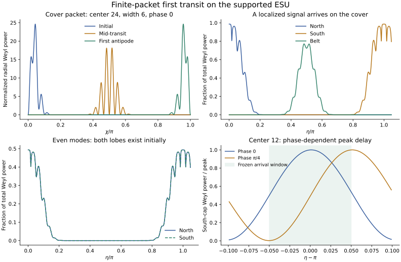

# Finite-packet first antipodal transit

**Five of six S3-cover preparations meet the frozen linear first-transit
criteria.** The sixth misses the arrival-time cutoff and is retained as
`NOT_ESTABLISHED`. All four numerical validation gates pass. The even-degree
preparations yield five paired recurrences and the same one failed timing
criterion. They do not describe delivery between independently located
antipodal objects on RP3.

This is a finite-band tensor disturbance on the exact breathing four-scalar
Einstein-frame background, with explicit spatial reconstruction and a local
curvature observable. It establishes neither nonlinear survival nor a
receiver's momentum response. The scalar quartet is retained matter; this
is not a derivation from vacuum GR.

## Public chronology

- Baseline: main `99c94fee6dc6f5158c1ccd8e791ccd51f52e3b5a`, merged #310.
- Prospective freeze: [`2eb1fec`](https://github.com/davidmdrpi/geometrodynamics/commit/2eb1fecb8d9884e768bdc1b4c3bc895f5aac09ce),
  published before implementing or measuring packet evolution.
- Implementation and measurements follow that freeze in this PR. No physical
  threshold, preparation window, start phase, aperture or timing criterion
  was changed after measurement. #308 was not rerun.

The new spatial construction is an explicit axisymmetric l=2 polar TT
harmonic for every n=2..80, with one fixed polarization. Its trace,
divergence, rough-Laplacian eigenvalue and electric-Weyl reconstruction
are checked with coordinate derivatives independently of the radial
construction. The full harmonic Gram matrix is checked across all degrees.

## Measured packet results

The source cap is chi<=0.3; the destination cap is chi>=pi-0.3. Fractions
refer to squared metric or Weyl norms, not energy. Weyl fractions are
reported at eta=pi. The state error compares (h,h'/(n+1)) with the negative
antipodal pullback of its initial value. All preparations are real,
time-symmetric or phase-shifted spectral pulses, not imposed absorbers.

| Spectral center, width | Phase | Initial metric source fraction | Antipodal state error | Final Weyl target fraction | Peak offset from pi | Frozen verdict |
|---|---|---:|---:|---:|---:|---|
| 12, 3 | 0 | 0.674299 | 0.02150635 | 0.713614 | +0.00100000 | LOCALIZED_FIRST_TRANSIT |
| 12, 3 | pi/4 | 0.674299 | 0.02149562 | 0.713756 | +0.05125222 | NOT_ESTABLISHED |
| 24, 6 | 0 | 0.984889 | 0.01117277 | 0.986686 | +0.00000000 | LOCALIZED_FIRST_TRANSIT |
| 24, 6 | pi/4 | 0.984889 | 0.01117133 | 0.986646 | +0.02700000 | LOCALIZED_FIRST_TRANSIT |
| 40, 10 | 0 | 0.999952 | 0.00680989 | 0.999911 | +0.00000000 | LOCALIZED_FIRST_TRANSIT |
| 40, 10 | pi/4 | 0.999952 | 0.00680957 | 0.999911 | +0.01600000 | LOCALIZED_FIRST_TRANSIT |

All six pass the localization, state-error, Weyl-retention and target/belt
criteria. For center 12, phase pi/4, the south-cap squared-Weyl peak occurs
at pi+0.05125222; the frozen maximum offset is 0.05. This is a phase-sensitive
power-peak criterion. It is not a wavefront-speed measurement, and no later
smoothing or envelope fit is used to turn the failure into a pass.

The amplitude scan epsilon=1e-6,1e-5,1e-4 is an exact scaling of a linear
solution: fields scale as epsilon, squared norms as epsilon^2. It supplies
no evidence of amplitude selection or nonlinear stability.



The plotted radial Weyl density includes the S3 radial volume factor and is
normalized separately at each displayed time. This shows spatial location;
it does not assert a conserved Weyl norm. Time curves are regional fractions
of the instantaneous full-sphere squared-Weyl norm.

## Topology and the physical response

For the center-24 cover packet the initial south-cap squared-Weyl fraction
is about 6.22e-19; after one transit about 0.986686 lies in that cap. These
finite-band tails are nonzero, so the calculation alone is not a sharp
causal-front or signaling proof. The largest retained cutoff window
(center 40, width 10) has larger antipodal tails, about 4.18e-9; this is a
specified finite preparation, not a claim of spectral-cutoff convergence.

The RP3-compatible tensor projection keeps even n. Its north and south lobes
are equal already at eta=0. For center 24 each initially contains about
0.493343 of the squared-Weyl norm. The union of the two caps is used for
its localization and retention tests, as frozen. It is one quotient
location recurring, not two receivers exchanging a signal. This distinction
must be retained when specifying the later two-object geometry.

The physical observable is the electric Weyl tensor in a background
comoving orthonormal frame,

    E_n = [n(n+2)h_n - h_n'']/(4f).

The background Weyl tensor vanishes, so this first-order curvature
perturbation is gauge invariant. It measures anisotropic curvature, not
by itself the complete matter-dependent geodesic-deviation response or a
detector's absorbed energy. The inherited action also yields the local
mixed-index support-stress response

    delta T^i_j(TT) = -R^2 h^i_j/f^2.

Thus a metric/stress channel exists even though the complete quartet's
scalar-intensity angular channel cancelled in #302. No mouth surface law,
material absorber, independently gravitating receiver or recoil is added.

## Instability budget

The independent scalar n=2 calculation gives:

- Floquet spectral radius per transit: **1.24754440027**.
- Largest sampled transient gain in (alpha,alpha'/3,beta,beta'/3):
  **3.28783905095**. A Floquet eigenvalue alone understates this gain.
- Largest sampled transfer norm from that initial state to pointwise
  Newtonian potentials: **1.26505193908**, including the normalized zonal
  harmonic's maximum 3/(sqrt(2) pi).
- The corresponding sampled linear seed limit for |Phi Y|,|Psi Y|<=0.01
  is **0.00790481378** in that explicitly specified state norm.

For the inherited homogeneous growing branch, exp(sqrt(2)pi)=
**85.0196952232**. An initial growing-branch fractional scale-factor
amplitude must be <=**1.17619805314e-4** to keep that component <=0.01 at the
first transit. This is the inherited homogeneous amplitude convention; it
is not a bound on every Einstein-frame metric component.

Zero, 1e-8, 1e-6 and 1e-4 seeds are tabulated in the evidence. For example,
the homogeneous 1e-4 seed grows to 0.00850197. The n=2 bounds are sampled
linear sensitivity estimates, not certified continuous-time extrema or a
nonlinear stability theorem. The computation does not determine the scalar
seeds generated at order epsilon^2 by the packet.

The next nonlinear experiment must solve the constraints with a finite
packet and evolve the sourced scalar modes through eta=pi. It should use
these numbers to choose and disclose its initial perturbation budget,
without projecting away the unstable modes. Two-object momentum balance
remains a subsequent test.

## Numerical evidence and implementation correction

**43 targeted tests and a fresh full packet replay pass.** Validation commands,
source hashes and dependency versions are recorded in `validation.json`.

- Maximum coordinate TT/Weyl residual: 9.52e-16.
- Full normalized harmonic Gram error: 2.04e-14.
- DOP853/Radau scaled tensor-map difference: 1.96e-10.
- Scalar-map/metric-transfer difference: 2.40e-11.
- 256/512-point regional quadrature difference: 1.32e-13 relative to
  full-sphere power.
- Artificial free-dispersion antipodal state error: 9.64e-15.
- Amplitude-squared scaling error: 4.88e-16; zero fields vanish exactly.

**Dated implementation correction, 2026-09-27:** an initial postprocessor
contracted regional Gram matrices before forming packet powers. Cancellation
between modes gave spurious negative values near 1e-16 in tiny tails. The
final postprocessor reconstructs the field at quadrature points and squares
it before summation, without clipping. This corrects tail estimates and
very large cap/belt ratios. The modal trajectories, frozen criteria and all
packet classifications are unchanged. No physical conclusion uses a
negative power or interprets a near-roundoff tail as exactly zero.

## #310 replay follow-up

The historical baseline and extension archives are unchanged. `replay`
now independently scores freshly measured evidence in full mode and requires
exact agreement of every categorical gate, row label and verdict. Full
extension replay also fully validates its input experiment and compares
fresh extension decisions. Partial replay is explicitly a partial audit.

Changing validator source hashes does not silently rewrite history. The
exact canonical historical #310 record is authenticated by a pinned SHA256;
new records bind current producer sources. A historical record modified
by even a tiny amount cannot use that legacy provenance exception.

The reviewed exploit jointly sets failing near-floor RK convergence errors
to zero and recomputes the derived result. It remains numerically within
the old 1e-9 comparison tolerance but is now rejected by full replay. Tests
exercise this with current producer hashes, so rejection is not merely a
side effect of the legacy-record digest.

A fresh complete #310 measurement was reused unchanged to validate the
historical baseline, validate the extension, and reject the jointly forged
record. All three checks passed. See `replay310.json`; neither #310's maps
nor historical verdicts were changed.

## Reproduction

Raw modal matrices from both integrators, scalar transfers, quadrature
matrices, coordinate checks, region-power time series, preparations,
source hashes and derived decisions are in
`experiments/closure_ledger/runs/20260927_finite_packet/`.
NumPy archives are loaded with `allow_pickle=False`.

```bash
python -m experiments.closure_ledger.finite_packet_probe --replay
python -m experiments.closure_ledger.finite_packet_probe --replay --full
python -m experiments.closure_ledger.finite_packet_figure
pytest -q tests/test_finite_packet.py tests/test_esu_floquet.py
```

A new measurement can be written to a separate directory with `--run-dir`.
Full replay remeasures in a temporary directory, reconstructs all decisions,
and compares them with the saved record. It leaves the published archive
unchanged. Partial replay also rechecks quadratures and reconstructs every
reported result and power curve, but does not independently re-integrate
modal solutions or repeat coordinate differentiation.
