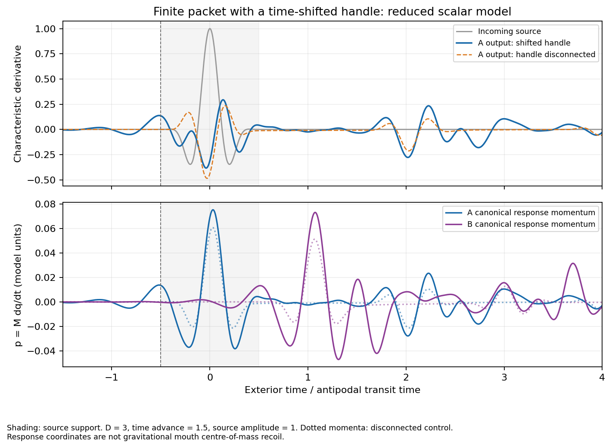

# Finite-packet MTY self-scattering: measured reduced-model result

All 32 scheduled histories passed the frozen numerical and mechanism gates:
**REDUCED_MTY_PACKET_SCATTERING_SUPPORTED**. This supports a bounded,
self-consistent nonlinear response to a compact source on the declared
time-shifted scalar graph. It does not establish a traversable GR solution,
gravitational mouth recoil, a unique history, or quantum particle exchange.

The [protocol](mty_packet_prereg.md), implementation and producer were published
in commit `786455dada520ecc3a867d508d73c99d76ef2627` before validation.
The producer verified the source bytes against that commit and recorded their
hashes. No measured source, threshold, schedule or horizon changed afterward.
Six preliminary pilots are disclosed in [mty_packet_pilots.json](mty_packet_pilots.json);
their finite-window losses motivated the horizon and iteration budget. They
are not included in the 32 validation histories.

## What the model tests

The bulk transit time is 1 and the proper handle transit time is
\(h=0.125\). The clock maps are \(\tau_A=t_A\),
\(\tau_B=t_B-\Delta\). An ideal prescribed out-and-back clock excursion
at speed \(\sqrt{3}/2\), lasting exterior time \(D\), gives
\(\Delta=D/2\). The source-to-future-B bulk path followed by B-to-A handle
return has exterior duration

\[
T_{\rm cycle}=1+h-\Delta=1.125-D/2.
\]

Each handle passage is locally future directed by positive proper duration
\(h\). Its B-to-A exterior delay can be negative. The offset was swept,
not fitted to a measured packet or phase closure. This clock preparation is
flat-clock kinematics, not an evolved moving-throat metric. For nonzero
excursions the ideal actuator supplies work 2 and recovers 2 per unit
preparation rest mass; vanishing net work does not make preparation free.

The scalar edges and two independent node coordinates have action

\[
S=\frac12\sum_e\int(\phi_t^2-\phi_x^2)\,dt\,dx
+\sum_{j=A,B}\int\left[\frac{M_j\dot q_j^2}{2}
-\frac{K_jq_j^2}{2}-\frac{\lambda_jq_j^4}{4}\right]dt.
\]

Here \(M=(0.1,0.15)\), \(K=(1,1.4)\), \(\lambda=(10,15)\).
Variation and field continuity give outgoing characteristic derivatives
\(b_{jp}=v_j-a_{jp}\), and
\(M_j\dot v_j=2\sum_p a_{jp}-3v_j-K_jq_j-\lambda_jq_j^3\).
The measured \(p_j=M_jv_j\) are canonical response momenta, not GR
center-of-mass momenta. The fixed anchor exchanges the restoring generalized
impulse; its potential energy is included, its finite-mass recoil is not.
Neither equal/opposite momenta nor a confirmation waveform is imposed.

The A lead supplies the compact packet
\(g(t)=A\cos^4(\pi t)\cos(4\pi t)\) for \(|t|<0.5\), zero otherwise.
The B lead has no independent source. Both outgoing leads are measured.
Disconnected handle ports become outgoing reservoirs whose flux is counted.
The graph retains an antipodal channel's travel time, not full S3 propagation
or focusing. The scalar handle sign is an assumed twisted line-bundle rule.
Support for a traversable channel is assumed, not inferred from trapped necks.

All incident and nonlinear-force histories are solved simultaneously using
nonperiodic zero-padded shifts. There are no corrective kicks. The primary
node update uses a quartic discrete gradient, with nonlinear midpoint as a
control. Both amplitudes use the same coefficients and clock history.

## Measured response

The table gives outgoing A-lead energy before source onset \(t=-0.5\),
divided by incident packet energy, on the fine grid. Values are fractions.

| D | Clock offset | Cycle duration | Amplitude 1 | Amplitude 2 |
|---:|---:|---:|---:|---:|
| 0 | 0 | 1.125 | 0 | 0 |
| 2.25 | 1.125 | 0 | 0 | 0 |
| 2.75 | 1.375 | -0.25 | 0.000759565 | 0.000761223 |
| 3 | 1.5 | -0.375 | 0.016883662 | 0.016923431 |
| 3.25 | 1.625 | -0.5 | 0.017717145 | 0.017610535 |
| 3, disconnected | 1.5 | No return cycle | 0 | 0 |

Thus the advanced cases return **0.076%–1.77%** of input energy before
source onset. Causal and disconnected controls return zero there. This is
conditional self-signaling in a complete-history solution; it is not a
no-signaling result or an independently prescribed backward source.



At D=3, disconnection changes the canonical response by 0.77335 and 0.76563
in relative L2 norm at amplitudes 1 and 2. Dividing the amplitude-2 response
by two leaves nonlinear shape changes 0.006560, 0.008039 and 0.009249 at the
three advanced offsets. Both exceed their registered mechanism gates.
The norm is the unweighted Euclidean norm of \((q_A,q_B,p_A,p_B)\),
integrated by the common time-grid sum, in the declared action's coordinates.
For D=3, amplitude 1, the separate peak absolute canonical momenta are
0.075260 and 0.073106; no reciprocity constraint sets them.

## Numerical and flux audit

The 32 histories comprise 20 primary runs (five offsets, two amplitudes,
two steps), four disconnected controls, and eight extent/seed/method/basis
controls. Steps are 1/128 and 1/256; the main window is [-16,64], with
[-24,96] extent controls at D=3. All solver statuses were CONVERGED.

| Diagnostic, largest observed | Value | Frozen upper bound |
|---|---:|---:|
| History matching residual / amplitude | 1.997e-9 | 1e-8 |
| Integrated field matching / amplitude | 3.025e-9 | 1e-5 |
| Local energy error / input, discrete gradient | 2.259e-14 | 1e-6 |
| Local energy error / input, midpoint | 6.060e-7 | 2e-3 |
| Canonical momentum defect / amplitude | 1.350e-13 | 1e-7 |
| Kinematic defect / amplitude | 8.566e-17 | 1e-8 |
| Whole-history energy defect / input | 7.306e-6 | 1e-4 |
| First/last two-unit port energy / input | 5.977e-5 | 1e-4 |
| Initial plus final node energy / input | 1.019e-7 | 1e-4 |
| Canonical state refinement difference | 0.001150 | 0.02 |
| Window extension difference | 0.000120 | 0.02 |
| Alternative nonlinear method difference | 1.205e-6 | 0.02 |
| Alternative seed difference | 3.668e-9 | 1e-5 |
| Reversed B basis, transformed back | 1.285e-12 | 1e-5 |

Local conservation is \(dE_j/dt=\sum_p(a_{jp}^2-b_{jp}^2)\).
The momentum ledger includes the anchor impulse. Integrated field matching
is checked independently of derivative matching, excluding hidden additive
field jumps across an advanced seam. Whole-history energy counts input,
all outgoing reservoir flux, and node energy change; residual transport
at the finite boundaries is tested by the tails and extended window.

Positive handle energy is evaluated on a common handle-clock slice. It is
not added to bulk energy at the same exterior time to claim conservation on
a global Cauchy slice. No such slice is supplied by this construction.
The source and receiver leads also make this a scattering model, not a
complete closed-universe simulation.

Failure was specified before validation: numerically valid histories with
any missing advance, disconnection effect or nonlinear response would yield
REDUCED_MTY_PACKET_SCATTERING_FAILED. A numerical gate failure would yield
NUMERICALLY_UNRESOLVED. The supported label applies only to the tested
schedule and declared boundary assumptions. Two seeds do not prove uniqueness.

## Evidence and reproduction

The [archive directory](../experiments/closure_ledger/runs/20261008_mty_packet/)
contains 32 lossless NPZ/base64 histories, provenance, results and a manifest.
Each history stores the iterate and both node coordinate/velocity arrays.
Replay reconstructs the fields, recomputes equations, fluxes, comparisons
and verdicts, and verifies source hashes and the complete archive inventory.
It does not rerun the nonlinear history solver or trust saved validity flags.

Manifest SHA-256:
`c2156a1de4ed711204f90ac333e8dfc933b0dd4223cb2e1008613c9810fcca2d`.

From the repository root with package dependencies installed:

```sh
OPENBLAS_NUM_THREADS=1 python -m experiments.closure_ledger.mty_packet_replay
OPENBLAS_NUM_THREADS=1 python -m pytest -q tests/test_mty_packet.py
OPENBLAS_NUM_THREADS=1 python -m experiments.closure_ledger.mty_packet_plot
```

The 21 focused tests passed, including altered-field, nonfinite-iterate,
wrong-schedule, missing-archive, corrupt-archive and manifest-tampering
rejections. Production used Python 3.12.14, NumPy 2.5.3 and SciPy 1.18.1.
Diagnostic replay also passed all six checks with NumPy 2.3.5 and SciPy 1.17.0;
this is a replay portability check, not another production simulation.

## Remaining physical gates

`gr_traversable_support`, `gravitating_mouth_recoil`, `unique_history` and
`action_discreteness` remain **NOT_ESTABLISHED**. The next physical work is
to specify supported finite-mouth metric matching and track actual
gravitational mouth/actuator recoil with a covariant stress-energy ledger.
The trapped-mouth exterior-interaction program remains distinct: trapping
does not by itself license this assumed traversable return channel. These
histories establish a conditional reduced mechanism and its controls, not
the availability of that channel in the earlier classical-GR neck data.
