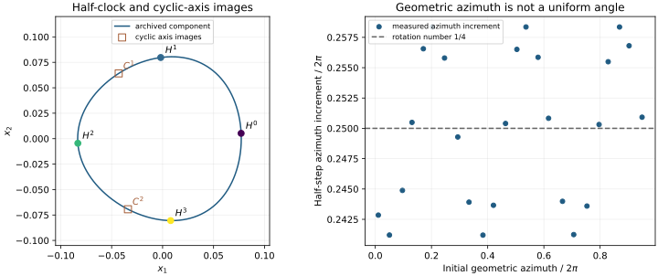

# The diagonal loop carries a twelvefold discrete action

The registered group-action test **passes**: `ORDER_TWELVE_SELECTION_SUPPORTED`.
On the labelled diagonal-circular component from #319, the half-clock map H
has oriented rotation number **1/4**, cyclic axis permutation C has rotation
**1/3**, and they commute. Their combined action first permits resonant angular
harmonic **12**, conditional on the numerically supported component invariance.
Reflection maps to the opposite coordinate-chirality component.

This changes the interpretation of the old unresolved obstruction. An order-4
comparison omitted spatial symmetry, while an order-6 comparison omitted the
half-clock map. Neither is the appropriate comparison for this circular branch.
The result provides a conventional reason to expect stronger suppression. It
**does not calculate its magnitude**, resolve a twelfth harmonic, prove exact
integrability or nonintegrability, or prove that the finite-resolution loop is
an exact continuum of periodic solutions.

## What was tested

The [protocol](r3_diagonal_symmetry_prereg.md), reduced equations, producer and
four off-family tests were published at
[`efbd82553b69c0ddcfc465406ff30c9f3bb8d92e`](https://github.com/davidmdrpi/geometrodynamics/commit/efbd82553b69c0ddcfc465406ff30c9f3bb8d92e)
before evaluating the new loop actions. The historical loop and previous
breaking result were already known; they are not newly held-out data. This is
a registered new symmetry test on that archive.

The 110 archived continuation points fit an unsymmetrized curve in geometric
shear azimuth. Every archived twelve-vector is **two six-dimensional nodes**.
The new computation samples 24 fixed indices, integrates four half transits,
checks the direct full return and the paired node, and tests spatial
commutation. An eight-state diagonal reduction supplies the primary map;
the original full homogeneous matrix equations supply independent DOP853
checks at all 24 starting points and Radau checks at six. A subsequent full
replay checks **all 96 half-step edges** against the full matrix equations.
These are independent formulations and numerical integrators, not an
independent derivation of Einstein dynamics.

| Registered quantity | Measured maximum | Gate |
|---|---:|---:|
| Unsymmetrized interpolation uncertainty | 9.9593e-10 | 5e-9 |
| H-image distance to the fitted component | 9.5476e-10 | 1.9919e-8 |
| C-image distance to the fitted component | 1.0038e-9 | 1.9919e-8 |
| H² minus direct P | 5.0714e-14 | 1e-10 |
| H⁴ minus identity | 9.2446e-11 | 1e-7 |
| Direct P minus archived paired node | 1.1150e-12 | 1e-10 |
| HC minus CH | 3.2629e-14 | 1e-10 |
| Reduced versus matrix DOP853 half map | 1.0875e-13 | 1e-10 |
| Reduced versus matrix Radau half map | 1.2153e-13 | 1e-10 |
| Absolute Hamiltonian constraint residual | 5.9508e-14 | 1e-10 |

Distances use the dimensionless coordinate maximum norm in
(A,p_A,x1,p1,x2,p2). Interpolation uncertainty includes withheld even/odd
prediction and degree-20/26 disagreement. Component membership is therefore
established at approximately **2e-8**, not at the 1e-13 map-agreement scale.
The 96-edge full replay has maximum error **1.3393e-13**.

H, H² and C each move every tested point by at least **0.2244** in that norm.
Four positive modulo-one azimuth increments sum to one, with maximum winding
error below 9.3e-13. Individual increments differ from 1/4 by as much as
0.008821: the rotation number is uniform, the geometric azimuth increments
are not. The four-half transit time lies in
[6.271615250392858, 6.271615250392923]. The larger H⁴ error is consistent with accumulation amplified by the existing
physical hyperbolic instability; this experiment does not change that instability.



## Why twelve follows, and what reflection means

In the orthonormal diagonal basis used by #319, C acts on both shape coordinates
and their canonical momenta by

\[
\begin{pmatrix}-1/2&-\sqrt3/2\\ \sqrt3/2&-1/2\end{pmatrix}.
\]

It is exactly a positive third turn in geometric shear azimuth. H is not a
rigid rotation in these coordinates. If the sampled component-preserving
finite-order actions extend to the whole invariant circle, their commuting,
faithful order-four and order-three actions admit a common circle angle. In
that angle H advances 1/4 and C advances 1/3; C H⁻¹ advances 1/12. A scalar
resonant term invariant under both must satisfy

\[
e^{2\pi i k/4}=e^{2\pi i k/3}=1,
\qquad k\in12\mathbb Z.
\]

This is an angular selection rule for the circular branch. It is not a
claim that a twelfth-degree coefficient has been measured in a full
multi-mode Birkhoff normal form. A finite numerical sample cannot establish
the assumed global invariant circle as a theorem.

The coordinate diagnostic J_d=x1*p2-x2*p1 ranges from -0.019642 to -0.017664
on the archived component; reflection gives positive values. It changes
along the loop and is neither a new conserved action nor physical SO(3)
angular momentum. These are components in a **labelled diagonal chart**:
axis permutations are part of the spatial rotation/relabeling identification,
and reflected representatives need not be distinct physical objects after
that identification. This result does not imply physical parity breaking.
Reflection relates resonant coefficients on those representatives; it does
not force the allowed twelfth coefficient to vanish.

The shear radius sqrt(x1²+x2²) is 0.077192–0.083320, and the archived canonical
action is about 0.01884737. Those sizes are descriptive. The LRS and circular
families have different coefficients and amplitude conventions, so scaling an
LRS signal by a bare twelfth power would not be a calibrated prediction here.

## Research judgement and the next test

The independent [LRS resonance ladder](https://github.com/davidmdrpi/geometrodynamics/blob/e7afdeb46e274799bd1c0ca749e85e52f70dc50c/docs/r3_ladder.md)
reports resolved breaking at all seven LRS rungs and supplies useful
high-precision controls. Its coefficients do not transfer directly to this
circular branch. That study was read as context; its computations were not
rerun here.

The surprising observation has narrowed: the diagonal loop still has no
resolved breaking in its original double-precision scan, but it now has a
known order-twelve protection. This strengthens the ordinary discrete-symmetry
explanation and lowers the priority of a hidden-integral claim. It gives no
new evidence for autonomous quantum action selection or wormhole-mediated
particle exchange.

The next discriminating experiment is a **high-precision obstruction and
isolated-orbit test on this same loop**, not a repeat of the double-precision
null result. A concrete proposed protocol, to be implemented and frozen before
its production values are read, is:

1. Implement independent arbitrary-precision diagonal event integration and
   augmented two-node shooting. Use 64 and 96 decimal digits, with recomputed
   returned-node closure residual <=1e-40. Preserve the historical phase slices
   for direct comparison; sample 192 phases and refine zero brackets.
2. Establish an obstruction error bound F from precision/order refinement,
   residual propagation through the augmented system, and an independent
   integration formulation. Require F<=1e-30 before interpreting a null result.
   Validate the machinery on the already resolved LRS 3/7 case and a numerical
   order-twelve positive control of known coefficient. The latter is a solver
   control, not an alteration of the GR model.
3. Seek a reproducible nonzero obstruction exceeding 100F and isolated
   unconstrained periodic orbits at its zero brackets. A leading twelfth term
   suggests 24 simple zeros around the labelled cover, counted before quotienting
   by temporal node swaps and axis relabeling. Do not count those representatives
   as 24 physically independent objects. Report each root's residual, separation,
   conditioning and symmetry-equivalence class.
4. Pre-state distinct outcomes: **resolved breaking** if nonzero obstruction
   and isolated roots reproduce; **unresolved at stated floor** if the accuracy
   gate fails; **additional suppression candidate** if the accuracy gate and
   positive controls pass but the obstruction stays below 100F. The last outcome
   is an upper bound and motivation for further work, not exact integrability.
   A detectable pattern inconsistent with a leading twelfth term rejects that
   *leading-term* hypothesis and requires checking higher terms or transverse
   coupling; it does not automatically falsify the exact discrete symmetries.

Pure raw-lambda Fourier support is not the falsifier: Euclidean slice
normalization and the nonuniform angle generate sidebands. For a quantitative
resonant coefficient, additionally construct a common symmetry angle with the
correct obstruction weight, or extract a symmetry-adapted resonant normal
form. The current test predicts neither a nonzero coefficient nor its size.

## Reproduction and provenance

```sh
OPENBLAS_NUM_THREADS=1 python -m experiments.closure_ledger.r3_diagonal_symmetry_probe --workers 4
OPENBLAS_NUM_THREADS=1 python -m experiments.closure_ledger.r3_diagonal_symmetry_replay --full
python -m pytest tests/test_r3_diagonal_symmetry.py tests/test_r3_diagonal_symmetry_replay.py -q
python -m experiments.closure_ledger.r3_diagonal_symmetry_figure
```

Production used Python 3.12.14, NumPy 2.3.5 and SciPy 1.17.0. All 13 focused
tests pass with both NumPy 2.3.5 and 2.2.6, including explicit failed-hypothesis and unresolved-accuracy
cases, structural damage, and altered-byte rejection. The replay authenticates
source/input hashes, the exact grid and saved nodes, reconstructs the original
per-job checkpoint hashes, and recomputes the registered score. Checkpoints
are omitted from git because each reconstructs exactly from actions.json.
The manifest SHA256 is
`60325afd032f044231e7bcca9ad3dc46e6aebf2303c7781b44f704e8b2019a94`.
All frozen historical files and this study's frozen producer remain unchanged.
