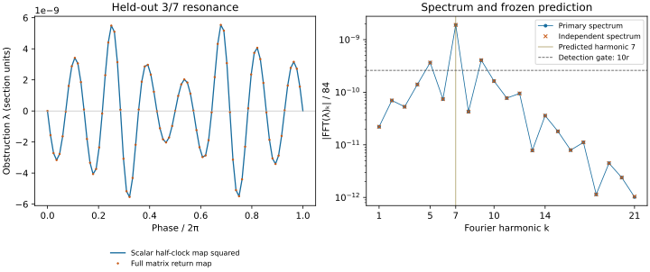

# The half-clock symmetry behind the R3 resonance scan

**The held-out prediction is supported and independently confirmed.**
An exact clock-sign symmetry explains the missing fifth resonant harmonic
at LRS 2/5 and predicts a detectable seventh harmonic at 3/7. The new scan
has that leading harmonic and 14 sign changes. Its amplitude clears the
registered detection gate by a factor of **7.32**.

The [protocol](r3_half_clock_prereg.md), code and tests were published at
`82c832f633a9bada476598df8b4806442d1f3b81` in PR #325 before evaluation.
This is a successful prediction about resonance structure. It strengthens
the discrete-symmetry explanation and weakens the earlier extra-integral
interpretation; the absolute splitting coefficient remains uncomputed.

## An exact symmetry supplies a missing selection rule

The earlier [breaking experiment](r3_breaking.md) found an obstruction at
the LRS 2/5 crossing with leading harmonic 10, below its registered detection
threshold. That prompted the question whether the system has an additional
integral. There is a simpler explanation for the missing fifth harmonic.

The scalar-sign involution

\[
 S:(A,A',q,q',x,x')\mapsto(A,A',-q,-q',x,x')
\]

commutes with the equations. The geometry depends on the clock through
\(q^2\) and \(q q'\), while the clock acceleration is odd in \(q\).
Identifying the next upward clock zero with the downward section using S
defines a symplectic map H. The old map satisfies **\(P=H^2\)**. The two
crossing intervals need not have equal elapsed time: no fixed-time
stroboscopic approximation enters this identity.

On the existing LRS circles the phase branch is

\[
 \rho_H=\frac{\rho_P+1}{2}\pmod 1,
 \qquad Q=\frac{2q}{\gcd(p+q,2q)}\quad(\rho_P=p/q).
\]

Thus P's 2/5 resonance is H's 7/10 resonance. P's 3/7 resonance is H's 5/7
resonance. Resonant order counting should use the shorter map.

One way to see the cancellation is to average a candidate angular term
\(e^{ik\theta}\) over the \(2q\) half-clock segments of a closed history:

\[
 \sum_{j=0}^{2q-1}e^{ikj\omega_H}
 =\bigl(1+e^{ik\omega_H}\bigr)
   \sum_{j=0}^{q-1}e^{ikj\omega_P}.
\]

At 2/5, k=5 passes the full-map orbit sum but the prefactor is zero;
k=10 passes both factors. At 3/7, k=7 passes both. In a resonant normal form,
angle dependence can first occur at Hamiltonian degree Q (vector-field
degree Q-1). This explains the *selection rule*. Computing its coefficient
and controlling the finite-amplitude remainder remain separate tasks.

These harmonic statements use a normal-form angle. The recorded obstruction
uses a phase slice of an interpolated circle and a unit Euclidean dual
tangent. Its parametrization and normalization can add sidebands. We do not
claim that every forbidden raw FFT bin vanishes exactly.

## Retrospective reproduction

Nine checks on existing circles compare H squared, integrated through the
scalar reduced equations, with P from the full homogeneous matrix equations.
The largest coordinate difference is **9.07e-13**. The correct half-clock
phase lift agrees with those circles within **1.29e-11**; the wrong lift
misses by at least **.00914**. The largest constraint residual is **1.59e-13**.

Re-solving 12 archived 2/5 phase slices gives a maximum obstruction of
**1.36e-11**, a maximum difference from the old scan of **8.30e-13**, and
correlation **.99886**. This independently reproduces the sampled tiny signal.
Twelve samples cannot independently identify its tenth harmonic without
aliasing; that identification comes from the earlier 60-phase study.
The old registered UNBROKEN_LOOP labels remain unchanged.

## Held-out experiment

The 84-phase 3/7 experiment was published before evaluation. Its registered
prediction requires dominant harmonic 7, amplitude at least ten times the
resolution, and exactly 14 cyclic sign changes. A numerically valid result
that lacks any of those properties counts as failure. The independent
checks use the full matrix equations with DOP853 and Radau.

Registered label: **SEVENTH_HARMONIC_PREDICTION_SUPPORTED**.

| Quantity | Measured value |
|---|---:|
| Accepted phases | 84 / 84 |
| Leading harmonic among k=1..21 | 7 |
| Cyclic sign changes | 14 |
| Seventh Fourier coefficient magnitude | 1.90605749e-9 |
| Maximum absolute obstruction | 5.53881947e-9 |
| Registered noise nu | 2.60266580e-12 |
| Resolution r=max(10nu,1e-11) | 2.60266580e-11 |
| Detection gate 10r | 2.60266580e-10 |
| Maximum phase-system residual | 2.579604e-13 |
| Maximum primary constraint residual | 9.725554e-14 |
| Maximum phase-system condition number | 9190.318 |

The seventh coefficient is approximately **330 times** the older archived
tenth coefficient, at the new resonance's own crossing. This compares two
different resonances; it is not an amplitude-scaling fit or a prediction of
the absolute coefficient.



### Independent checks and the disclosed validation amendment

The original seven noise phases all sample the same phase of harmonic 7.
The [validation note](r3_half_clock_validation_note.md), published while
production was running and before any new obstruction values were inspected,
adds full-matrix DOP853 checks at every phase and Radau checks at seven
different harmonic phases. The original scoring rule is unchanged.

| Independent check | Result |
|---|---:|
| Full-matrix DOP853 phases | 84 / 84 |
| Alternative seventh coefficient | 1.90605573e-9 |
| Maximum difference from primary lambda | 3.982966e-13 |
| Correlation with primary waveform | .999999999381 |
| Supplemental noise, including Radau residuals | 2.319321e-12 |
| Combined resolution | 2.60266580e-11 |
| Alternative leading harmonic / sign changes | 7 / 14 |
| Full-equation residual at all 84 archived node sets | 1.647610e-12 |

Both the original and alternative spectra retain the prediction at the
combined resolution. Some alternate chord solves reach the six-iteration
limit with residuals above the 2e-13 Newton target. These residuals are
included in the noise budget, not silently treated as zero; their maxima
are 2.57e-12 in the original checks and 2.29e-12 in the supplement.

The raw spectrum includes sidebands, especially k=5 and k=9, consistent with
the phase-coordinate caveat above. The registered claim concerns the leading
harmonic, not exact vanishing of all the other raw bins.

## Interpretation and limits

The exact square-root relation explains why the earlier denominator-five
expectation was too aggressive. A normal form for H forbids that resonance
term without assuming an additional continuous symmetry. This removes one
piece of the argument for hidden integrability; it does not prove absence
of all extra integrals or quantitatively explain the old signal's size.

The diagonal-circular #319 loop is a separate case. Its half-clock action
must be established on that family and combined with its spatial D3
symmetry before assigning a first allowed harmonic. This PR makes no such
assignment. Generic full-system stability, inhomogeneous modes, quantum
action selection and evolving-background wave transport are also untested.

This study scores a closure obstruction, rather than locating and classifying
all periodic orbits and their residues. It does not inherit the older
experiment's BROKEN_CHAIN label, which required a separate isolated-orbit
gate. Its positive prediction is the detectable seventh-harmonic obstruction
specified in this study's own protocol.

These are finely tuned multiple-shooting histories. They retain the physical
hyperbolic direction and do not demonstrate robustness of freely evolved
initial data. Lambda is measured in the specified section coordinates; it
is not an invariant energy transfer or a physical decay rate.

## Reproduction and provenance

The historical breaking files are byte-for-byte unchanged. This PR is
stacked on `claude/geometrodynamics-qft-audit-vpktax` because it contains those
inputs. The producer archives bind all frozen sources and both
input archives. A pinned manifest authenticates their bytes. Replay also
recomputes the score; `--full` reevaluates every held-out phase with the
independent full-equation map.

The initial execution stopped after 63 convergence messages, before saving
the scan. The [recovery note](r3_half_clock_recovery_note.md) records why all
84 calculations were executed again with unchanged numerical code and
per-phase checkpoints. This is one completed calculation after an interrupted
attempt, not two independent replications. Replay checks that every phase
checkpoint is exactly reconstructible from the published aggregate.

The supplemental checks use a checkpointed four-worker scheduler written
after inspection of the primary spectrum. Its numerical per-check body is
verified structurally against the previously published validation module;
the integrators, phases, tolerances and confirmation rule are unchanged.
The archive binds both implementations. This changes execution scheduling,
not the earlier timing disclosure for the validation amendment.

```sh
OPENBLAS_NUM_THREADS=1 python -m pytest -q tests/test_r3_half_clock.py tests/test_r3_half_clock_replay.py tests/test_r3_breaking.py
OPENBLAS_NUM_THREADS=1 python -m experiments.closure_ledger.r3_half_clock_replay
OPENBLAS_NUM_THREADS=1 python -m experiments.closure_ledger.r3_half_clock_replay --full
```

The producer is intentionally exclusive: it refuses to overwrite an existing
run directory. Reproducing production requires a fresh checkout of the
published freeze, before the result archives were added.

Validation: **24 focused tests pass** (21 numerical/scoring tests and three
new authentication/replay tests). The three replay tests also pass with
NumPy 2.2.6. Production used Python 3.12.14, NumPy 2.3.5 and SciPy 1.17.0.
The complete full-equation replay verifies every stored phase, with the
maximum residual shown above. No frozen source or historical input changed.

The next mathematical target is the diagonal-circular family: establish how
H acts on its closed loop, combine that action with its spatial D3 symmetry,
then compute the first allowed resonant coefficient. The present result
supports that concrete route more strongly than fitting an unspecified
extra integral to the already-known trajectories.
